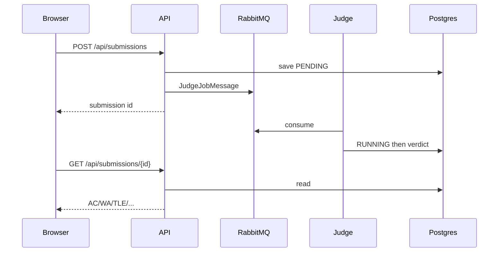
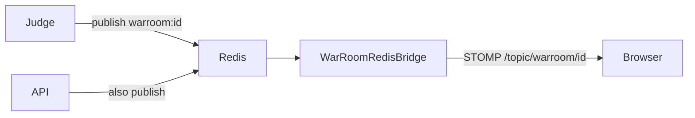

# Architecture

## Goal

Run user code safely enough for a college demo, keep API thin, and support a simple live race (War Room).

## Components

| Piece | Role |
|-------|------|
| `apps/web` | React SPA (Vite + Monaco) |
| `services/api` | REST, JWT, WebSocket/STOMP |
| `services/judge` | Queue consumer, sandbox, verdict writer |
| `services/common` | JPA entities + enums + job message |
| Postgres | Users, problems, submissions, rooms… |
| RabbitMQ | Practice + war judge queues |
| Redis | Rate limits + war-room pub/sub bridge |

## Main flow (submit)

## War Room events

## Security boundaries

- Passwords: bcrypt
- API: JWT Bearer; admin routes need ADMIN
- Verdicts written only by judge service DB access path
- Submit/discussion/company-tag: Redis rate limit
- Sandbox: no network in docker mode; process mode is weaker (local demo)

## Why this split

API should not run user code (timeouts, crashes, security).
Queue absorbs bursts; war queue keeps races ahead of practice traffic.

## Scale notes (honest)

Fine for campus demo / portfolio.
Not Codeforces: no isolate pool, no fair RR scheduler, no multi-region WS.
